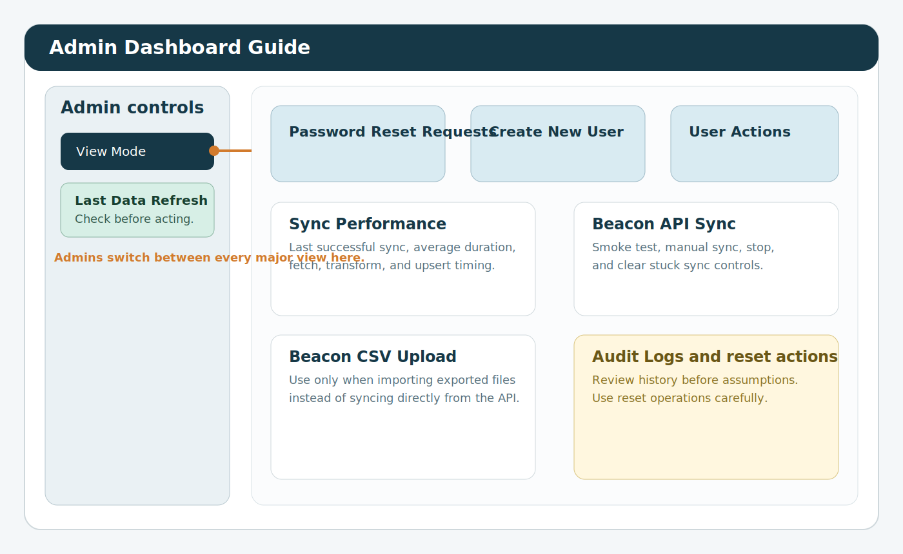

# Admin Dashboard Manual

> Audience: `Admin` users  
> Scope: user accounts, data refresh, audit review, and full reporting access

## 1. About this guide
This guide explains how to use the dashboard as an Admin.

Admins have the widest level of access in the system. You are responsible for:

- creating and updating user accounts
- handling password reset requests
- changing user roles and access
- checking whether data is up to date
- running manual refresh actions when needed
- reviewing audit history

Available views:

- `Admin Dashboard`
- `KPI Dashboard`
- `Custom Reports Dashboard`
- `Case Studies`
- `Funder Dashboard`
- `ML Dashboard`

## 2. Before you make changes
Use this quick checklist before changing anything important.

1. Make sure you are signed in with your own Admin account.
2. Check the `Last Data Refresh` time in the sidebar.
3. Be clear about why you are making the change.
4. Choose the smallest action that solves the problem.
5. Be especially careful when deleting users or resetting data.

## 3. Signing in
1. Open the dashboard link.
2. Enter your email address and password.
3. Change your password if the system asks you to do so.
4. Use `View Mode` in the left sidebar to move between screens.

If you see `Admin client not available`, the system is missing some Admin configuration and should be checked before you continue.

## 4. Main areas of the Admin Dashboard
The `Admin Dashboard` is the control area for running the system.

Main sections:

- `Password Reset Requests`
- `Create New User`
- `Existing Users & Actions`
- `Sync Performance`
- `Beacon API Sync`
- `Beacon CSV Upload`
- data reset actions
- `Audit Logs`

## 5. User management
### 5.1 Handle a password reset request
Use this when a user has clicked `Forgot password?`.

1. Open `Password Reset Requests`.
2. Choose the user’s email address.
3. Enter a temporary password.
4. Click `Set Temporary Password`.
5. Tell the user to sign in and change the password straight away.

What happens next:

- the reset request is marked as completed
- the user is asked to change the password at next sign-in
- the action is recorded in the audit log

### 5.2 Create a new user
1. Open `Create New User`.
2. Enter the person’s full name.
3. Enter their email address.
4. Enter a starting password.
5. Choose one or more roles.
6. Choose a region from the dropdown if the user is not a funder.
7. If the user is a funder, choose the funder name or enter one manually.
8. Click `Create User`.

Good practice:

- use a named work email where possible
- avoid shared accounts
- give the lowest level of access the person needs

### 5.3 Update an existing user
The `Existing Users & Actions` area lets you update a user without deleting and recreating the account.

You can:

- reset a password
- update roles
- update name, email, and region
- delete a user

### 5.4 Reset a password manually
1. Go to `Existing Users & Actions`.
2. Open `Reset Password`.
3. Select the user.
4. Enter the new temporary password.
5. Apply the change.

Use this when the normal self-service route is not enough.

### 5.5 Update a user’s role
1. Open `Update Role`.
2. Select the user.
3. Choose the correct role or roles.
4. If `Funder` is selected, confirm the correct funder name.
5. Enter the reason for the change.
6. Confirm the update.
7. Click `Update Role`.

### 5.6 Update a user’s details
1. Open `Update User Details`.
2. Select the user.
3. Update their full name if needed.
4. Update their email address if needed.
5. Update their region if needed.
6. Enter the reason for the change.
7. Confirm the update.
8. Click `Update User Details`.

### 5.7 Delete a user
1. Open `Delete User`.
2. Select the user.
3. Enter the reason for deletion.
4. Confirm the action.
5. Click `Delete User`.

Delete a user only when they should no longer have access at all. If they still need access, a role or profile update is usually better.

## 6. Data refresh and sync checks
### 6.1 Sync Performance
Use `Sync Performance` to check whether the system is healthy.

This section helps you review:

- how long the last sync took
- whether the last run was manual or automatic
- whether the data may be out of date
- whether recent syncs are getting slower

### 6.2 Run a Beacon smoke test
Use `Run Beacon API Smoke Test` before a full manual sync if you are checking for connection problems.

This is the safest first step because it checks the connection without running a full import.

### 6.3 Run a manual sync
1. Open `Beacon API Sync`.
2. Run a smoke test first if you are troubleshooting.
3. Click `Sync Beacon API to Database`.
4. Watch the progress messages.
5. Use `Stop Manual API Sync` only if the sync is clearly stuck.
6. Use `Clear Stuck Sync` only after checking there is no live sync still running.

### 6.4 Upload Beacon CSV files
Use this only when you are intentionally loading exported CSV files instead of using the API.

1. Open `Beacon CSV Upload`.
2. Select the required files.
3. Start the upload.
4. Check the result message before moving on.

### 6.5 Reset or rebuild dashboard data
Treat reset actions as maintenance work.

Use them only when:

- an import has failed badly
- the working data needs rebuilding
- support or data checking work has agreed that a reset is needed

Do not use reset actions casually during active reporting.

## 7. Audit logs
The `Audit Logs` section shows a history of important actions.

Use it to check:

- who changed a role
- who changed a user profile
- who reset a password
- who started a sync
- who deleted a user
- who saved or shared a report

Use the log when investigating support issues or checking accountability.

## 8. Other dashboards available to Admins
### KPI Dashboard
Use this for:

- headline KPI monitoring
- drill-down into supporting records
- validation using `Show KPI Debug`

### Custom Reports Dashboard
Use this for:

- detailed tables
- charts
- exports
- advanced filters
- distance analysis

### ML Dashboard
Use this for:

- event-by-event review
- participant review where source data supports it
- medical and emergency information where available

### Funder Dashboard
Use this for:

- checking what funder-facing users will see
- sponsor or funder reporting review

### Case Studies
Use this for:

- reading existing stories
- filtering by date and region
- adding new stories and testimonials

## 9. Recommended way of working
1. Check `Last Data Refresh`.
2. Review `Sync Performance` if the data looks old.
3. Run a smoke test before a manual sync.
4. Record a clear reason before changing access or deleting a user.
5. Check the audit log if you are unsure what has already happened.

## 10. Troubleshooting
### `Admin client not available`
- check the Admin Supabase settings
- confirm the service-role configuration is loaded correctly

### Sync looks stuck
- review the sync status first
- use `Stop Manual API Sync` only when needed
- use `Clear Stuck Sync` only after checking nothing is still running

### A user cannot sign in
- check whether they requested a password reset
- reset the password manually if needed
- check that the user still has the correct role

### The dashboard looks out of date
- check `Last Data Refresh`
- review `Sync Performance`
- run a smoke test and then a manual sync if needed

### Someone needs different access
- update the role instead of deleting the account
- use least privilege
- record the reason for the change
