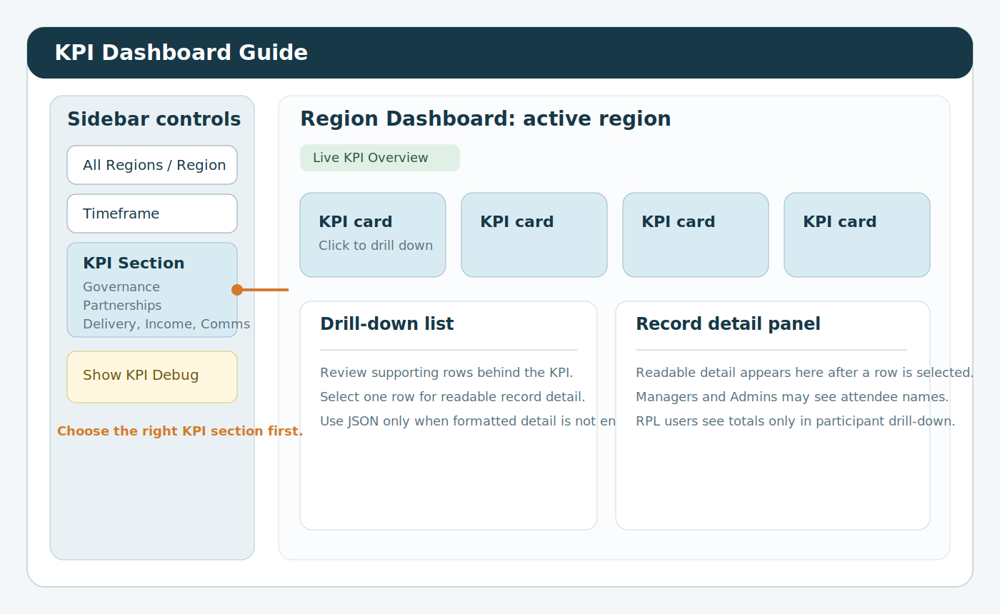
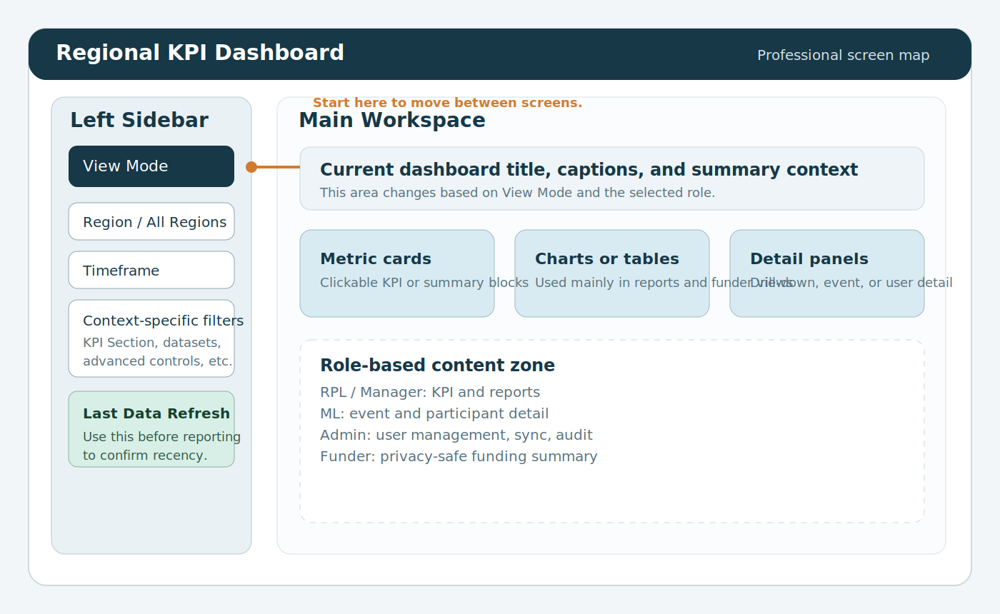
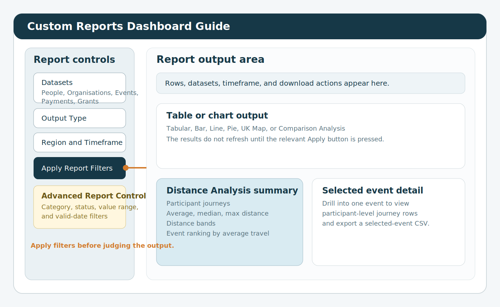
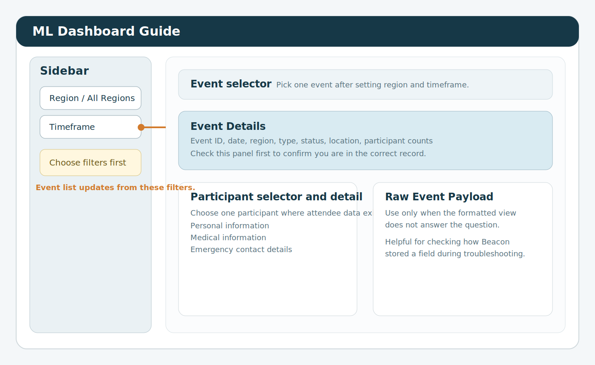
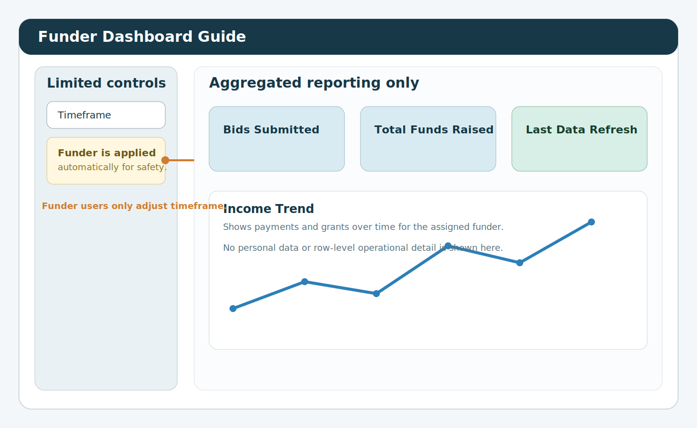

# Manager Dashboard Manual

> Audience: `Manager` users  
> Scope: operational reporting, KPI validation, event review, case studies, and funder-facing oversight

## 1. Introduction
This manual explains how Managers use the dashboard across the main reporting and operational views.

The Manager role is designed for people who need to move between:

- headline oversight
- KPI validation
- structured reporting
- event-level review
- funder-facing summary checks
- case study capture and review

Managers can open:

- `KPI Dashboard`
- `Custom Reports Dashboard`
- `Case Studies`
- `Data Request Form`
- `Funder Dashboard`
- `ML Dashboard`

Managers cannot open:

- `Admin Dashboard`

Managers have broader operational visibility than RPL users, but they still are not system administrators. If a task involves user access, password resets, sync control, or audit review, it belongs with an `Admin`.

## 2. What the Manager role is for
Use the Manager role when you need to:

- review performance across multiple dashboard areas
- validate a KPI before it is shared more widely
- check one event in operational detail
- prepare a chart or export for leadership use
- review what a funder-facing screen shows
- confirm whether unusual data reflects a real change or a data issue

This role is not intended for:

- creating or deleting users
- running sync maintenance
- changing system configuration

## 3. Signing in and first checks
When you sign in:

1. Enter your email address and password.
2. Change your password if prompted.
3. Check `Last Data Refresh`.
4. Choose the correct screen in `View Mode`.
5. Confirm your region and timeframe settings before beginning any review.

A Manager often switches between more than one screen during the same task. That is expected. Start with the view that gives the fastest answer, then move into a more detailed screen if the question requires it.

## 4. Understanding the layout
The left sidebar controls most navigation.

Important controls usually include:

- `View Mode`
- region controls
- timeframe controls
- screen-specific controls such as `KPI Section`

Use the screens like this:

- `KPI Dashboard` for headline review
- `Custom Reports Dashboard` for structured analysis, exports, and charts
- `ML Dashboard` for one-event-at-a-time review
- `Funder Dashboard` for sponsor-facing summary checks
- `Case Studies` for narrative evidence
- `Data Request Form` for submitting and reviewing data access requests

## 5. Filters and navigation
Good filtering habits matter because a wrong region or timeframe can make correct data look wrong.

### 5.1 Region filtering
Use `All Regions` when:

- you are checking whether something exists at all
- you need a high-level organisational picture
- you want to compare one region with the wider context

Use a single region when:

- you are validating a regional KPI
- you are reviewing a regional trend
- you want a cleaner chart or export
- you are following up on a regional issue

### 5.2 Timeframe filtering
Typical timeframe options include:

- `All Time`
- `Year`
- `Quarter`
- `Month`
- `Week`
- `Custom Range`

Recommended practice:

1. Start with a wider timeframe if you are uncertain.
2. Confirm the records exist.
3. Narrow to the exact reporting period.

### 5.3 Recommended navigation pattern
For most Manager tasks:

1. Start in `KPI Dashboard`.
2. Identify the KPI section involved.
3. Open drill-down if needed.
4. Move to `Custom Reports Dashboard` if you need structure or export.
5. Move to `ML Dashboard` if the issue is event-specific.
6. Move to `Funder Dashboard` if you need to check what an external-style restricted view shows.

## 6. KPI Dashboard
The `KPI Dashboard` is the main place for headline operational review.

### 6.1 When to use KPI Dashboard
Use it when you want to:

- see the current headline picture quickly
- review delivery, governance, and partnerships
- identify where a result has shifted
- check whether a number looks credible
- open the supporting rows behind a KPI card

### 6.2 KPI sections
Depending on the region context, the sections can include:

- `Governance`
- `Partnerships`
- `Delivery`
- `Income`
- `Comms`
- `Case Studies`

The section selector is important. If a number seems to be missing, first confirm that you are in the correct section.

In the `Delivery` section, demographics are split into separate `Gender` and `Age` cards.

The `Gender` card can include `Men`, `Women`, `Trans / Non-binary / Gender diverse`, `Prefer not to say`, and `Unknown / Not provided`.

The `Age` card can include:

- `18-30`
- `30-40`
- `40-45`
- `45-65`
- `65-75`
- `75+`
- `Unknown Age`

If `Unknown Age` appears, attendee rows are present but no usable age value has been synced for some or all of the selected records.

### 6.3 Step-by-step KPI review
1. Open `KPI Dashboard`.
2. Set the relevant region.
3. Set the relevant timeframe.
4. Choose the correct KPI section.
5. Review the visible cards.
6. Note anything that looks unusual.
7. Click the relevant KPI card.
8. Review the rows returned by the drill-down.
9. Decide whether the KPI is correct, unclear, or needs a deeper report-based check.

### 6.4 Using drill-down
Drill-down is the quickest way to understand what sits behind a KPI.

Use it when:

- a KPI is unexpectedly high or low
- someone asks what is included in a total
- you want to identify which records are driving a change

When reviewing drill-down results:

- confirm the timeframe still matches your question
- look for obvious duplicate or missing records
- note whether the supporting rows match the story the headline card suggests

If the drill-down gives only part of the answer, rebuild the question in `Custom Reports Dashboard`.

### 6.5 Using KPI Debug
Managers can use `Show KPI Debug`.

This shows extra support counts such as:

- people
- volunteers
- steering volunteers
- events
- participants
- grants
- bids submitted

Use `Show KPI Debug` when:

- the headline KPI looks wrong
- you need to understand whether the source population looks plausible
- you want to separate a source-data problem from a calculation problem

Suggested process:

1. Review the headline KPI.
2. Turn on `Show KPI Debug`.
3. Compare the supporting counts with what you expect.
4. Decide whether the issue looks like source data, filtering, or KPI logic.

## 7. Custom Reports Dashboard
Use `Custom Reports Dashboard` when you need structured analysis, exportable data, or chart-based output.

### 7.1 What this screen is for
Use it when you need to:

- inspect rows directly
- export CSV data
- build charts for packs or presentations
- compare categories, statuses, or regions
- validate a KPI against row-level data
- review travel analysis

### 7.2 Datasets available to Managers
Managers can work with:

- `People`
- `Organisations`
- `Events`
- `Payments`
- `Grants`

Use them like this:

- `People`: participant or people-record analysis where your role permits it
- `Organisations`: organisation activity, partnership analysis, and status review
- `Events`: delivery volume, event type, event timing, event status, and regional delivery questions
- `Payments`: income records and timing
- `Grants`: grant lifecycle, outcomes, awards, and closures

### 7.3 Main report workflow
Use the same pattern every time:

1. Open `Custom Reports Dashboard`.
2. Choose one or more datasets.
3. Choose the `Output Type`.
4. Set region and timeframe.
5. Click `Apply Report Filters`.
6. Review the returned result.
7. Open `Advanced Report Controls` if the result is too broad.
8. Apply advanced filters.
9. Review the revised output.
10. Download CSV if needed.

This screen works in two stages:

- `Apply Report Filters` refreshes dataset, output type, region, and timeframe
- `Apply Advanced Filters` narrows the already returned rows

### 7.4 Output types explained
Available output types are:

- `Tabular`
- `Bar`
- `Line`
- `Pie`
- `UK Map`
- `Comparison Analysis`
- `Distance Analysis`

Choose them like this:

- `Tabular` for row-level review and export
- `Bar` for simple grouped comparisons
- `Line` for trends over time
- `Pie` for share-of-total views
- `UK Map` for regional distribution
- `Comparison Analysis` for direct group-versus-group comparison
- `Distance Analysis` for participant travel questions

### 7.5 Grouping, metrics, and aggregation
Most chart outputs require three choices:

- `Group By`
- `Metric`
- `Aggregation`

These choices determine what the chart actually means:

- `Group By` decides how the report is split
- `Metric` decides what value is measured
- `Aggregation` decides whether you are summing values, counting rows, or taking an average

Always sense-check the chart title and axes after making these selections so that you know the visual matches the question you are trying to answer.

### 7.6 Advanced Report Controls
Advanced controls include:

- `Limit to datasets`
- `Category filter`
- `Status filter`
- `Metric value range`
- `Only include rows with valid date`

Practical uses:

- use `Status filter` to isolate active, completed, approved, or similar statuses
- use `Category filter` when you need one strand of activity rather than the full mix
- use `Metric value range` to remove outliers or zero-value rows
- use `Only include rows with valid date` before using `Line`
- use `Limit to datasets` when you selected broadly at the start and want to narrow inside the current result

If the result becomes empty:

1. Remove the most restrictive advanced filter.
2. Reapply.
3. Add filters back one at a time.

### 7.7 Comparison Analysis
`Comparison Analysis` lets you compare one group against another on the same dimension.

This is useful for questions such as:

- how one region compares with another
- whether one status materially differs from another
- whether one category is larger than another
- what the absolute and percentage gap is between two groups

Typical workflow:

1. Choose the relevant dataset.
2. Choose `Comparison Analysis`.
3. Apply the main filters.
4. Choose the comparison dimension.
5. Select the baseline value.
6. Select the comparison value.
7. Review the totals, difference, and percentage gap.

### 7.8 Distance Analysis
`Distance Analysis` focuses on participant travel to events.

It can show:

- participant journeys
- average distance
- median distance
- maximum distance
- distance bands
- events ranked by average travel distance

You can also:

- filter by event type
- keep only rows with resolved distance
- drill into a selected event
- inspect journey-level rows
- download a CSV for the selected event or the full analysis

Use it when you need to discuss:

- reach
- accessibility
- travel burden
- whether some events draw participants from further away than others

If the result looks thin, check:

- timeframe
- event type filters
- missing postcode data
- whether unresolved rows are being filtered out

### 7.9 Example report workflows
To validate a KPI:

1. Note the KPI region and timeframe.
2. Open `Custom Reports Dashboard`.
3. Choose `Tabular`.
4. Choose the relevant dataset.
5. Match the same region and timeframe.
6. Review whether the rows support the KPI story.

To prepare a presentation chart:

1. Choose the relevant dataset.
2. Choose `Bar` or `Line`.
3. Set a readable grouping.
4. Narrow the report so the chart stays clear.
5. Review the title and axes before using the chart externally.

## 8. ML Dashboard
Managers can use the `ML Dashboard` for one-event-at-a-time checking.

### 8.1 When to use ML Dashboard
Use it when:

- the question is about one event rather than a region-wide trend
- you need to review event details
- you need to check participant information where available
- you need to confirm whether an event record looks complete
- you need to review medical or emergency details for operational reasons

### 8.2 Workflow
1. Open `ML Dashboard`.
2. Set region and timeframe.
3. Choose the event.
4. Review event details first.
5. Review participant information where needed.
6. Review medical or emergency detail only where operationally necessary.

### 8.3 Good practice
- always confirm the event details before reviewing participant information
- use participant and medical information only for legitimate operational need
- if details are missing, check whether the source data simply does not contain them before assuming there is a system fault

## 9. Funder Dashboard
Managers can open `Funder Dashboard` to review sponsor-facing summary figures.

### 9.1 When to use Funder Dashboard
Use it when:

- preparing for sponsor or funder conversations
- checking bids submitted and total funds raised
- reviewing the high-level trend view
- quality-assuring what a restricted funder user will see

### 9.2 Workflow
1. Open `Funder Dashboard`.
2. Set the timeframe.
3. Review the headline cards.
4. Review the trend view.
5. Check `Last Data Refresh`.

## 10. Case Studies
Managers can read and upload case studies.

Use them when:

- a KPI needs narrative context
- a report needs a real example
- a team wants to capture a strong story after delivery

### 10.1 Reading case studies
1. Open `Case Studies`.
2. Filter by date or region if needed.
3. Review titles and dates.
4. Select the most relevant story for the reporting period or discussion.

### 10.2 Uploading case studies
1. Open `Case Studies`.
2. Filter first to avoid duplicates.
3. Add a clear title.
4. Add the story text.
5. Set the correct date.
6. Set the correct region.
7. Submit and review the saved result.

## 11. Data Request Form
Managers can use `Data Request Form` in two ways:

- to submit a request themselves
- to review requests submitted by other users

### 11.1 Submitting a request
All fields are required:

- `Name`
- `Email`
- `Date`
- `Time`
- `Reason for data request`

Workflow:

1. Open `Data Request Form`.
2. Choose the matching name and email for the user making the request.
3. Set the date and time.
4. Enter a clear reason.
5. Submit the form.

### 11.2 Reviewing requests
Managers also see the request review area on the same page.

Use it to:

- review recently submitted requests
- see whether a request is `Pending`, `In Review`, or `Completed`
- update request status after you have reviewed it

When a request is submitted, Managers are notified in the dashboard.

## 12. Recommended working pattern
For most Manager tasks:

1. Start in KPI for the headline view.
2. Use drill-down or `Show KPI Debug` if something needs checking.
3. Move to `Custom Reports Dashboard` for structured validation or export.
4. Move to `ML Dashboard` if the issue is event-specific.
5. Move to `Funder Dashboard` if you need a sponsor-facing view.
6. Use case studies when the numbers need narrative evidence.

## 13. Good working practice
- check `Last Data Refresh` before quoting figures
- widen filters first if expected data is missing
- treat operational and personal information carefully
- use the right screen for the job rather than forcing one screen to answer every question
- export only what you actually need
- update data request statuses when you complete a review

## 14. Troubleshooting
### A KPI number looks wrong
1. Recheck the region and timeframe.
2. Open the KPI drill-down.
3. Turn on `Show KPI Debug`.
4. Rebuild the question in `Custom Reports Dashboard` if needed.

### A report does not refresh
1. Click `Apply Report Filters` if you changed the main report settings.
2. Click `Apply Advanced Filters` if you changed advanced controls.

### Attendee detail is missing
- not all events contain complete attendee detail
- visibility depends on source data

### The Funder Dashboard looks empty
- widen the timeframe
- check whether the selected funder context has matching data

### The wrong event appears in ML Dashboard
1. Check region and timeframe.
2. Reselect the event after changing filters.
3. Confirm the event name and date before continuing.
